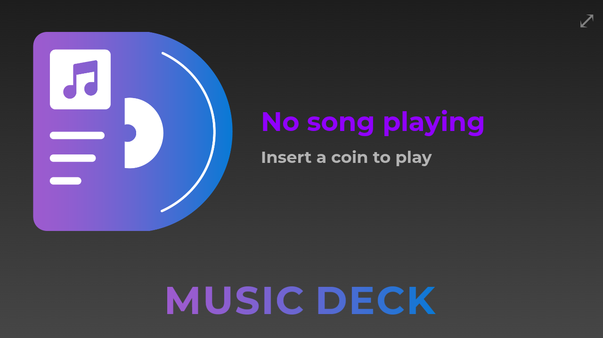
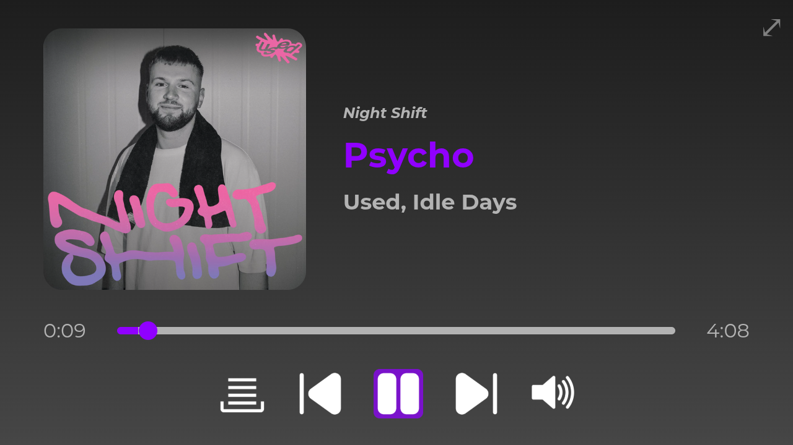

<details>
<summary>README is WIP</summary>

# Final work - Music Deck
This repository serves as a PoC of Spotify's Web API and Web Playback SDK 

## :computer: App: Spotify Jukebox
This app allows users to search for songs, artists, and albums using Spotify's Web API. The user can play the songs in the browser using the Web Playback SDK or add them to the queue. Users can also request a QR-code to play the currently playing song on their mobile device.<br><br>

<br>


## :wrench: Installation
### :gear: Prerequisites
- [ ] Have a Spotify account with a premium subscription
- [ ] Create a Spotify app in the [Spotify Developer Dashboard](https://developer.spotify.com/dashboard/applications)
  - [ ] Save the `Client ID` and `Client Secret` for later use
  - [ ] Add a redirect URI in the Spotify app settings (e.g. `http://localhost:8888/callback`). It is important to use this URL in the rest of your code when authenticating with Spotify.
  - [ ] In "APIs used", choose `Web Playback SDK` and `Spotify Web API`
- [ ] Create a `.env` file in the root directory of the project and add the following:
    ```bash
    CLIENT_ID=<your-client-id>
    CLIENT_SECRET=<your-client-secret>
    API_URL=http://localhost:8888
    CLIENT_URL=http://localhost:5500
    ```
- [ ] Check the [`config.js`](./config.js) file and make sure the apiUrl matches the `API_URL` in the `.env` file
- [ ] The scopes for authentication are set in the [`api.js`](api.js) file. Choose `'user-read-private', 'user-read-email', 'user-read-playback-state', 'user-modify-playback-state', 'streaming'`. You can find more scopes in the [Spotify Web API documentation](https://developer.spotify.com/documentation/general/guides/scopes/)

### :bust_in_silhouette: Manual installation
1. Clone this repository and navigate to the directory
```bash
git clone https://github.com/SandroBarillaPXL/expertlab-sprint3-scraping
cd expertlab-sprint3-scraping
```
2. Install the dependencies
```bash
npm install
```	
3. Start the backend API-server, accessible at `http://localhost:8888`
```bash
node api.js
```
4. Start the frontend with a simple HTTP server of your choice, like the "live server" extension in Visual Studio Code for local use. Make sure the frontend is accessible at `http://localhost:5500` (or the same URL you send your callbacks to. See [Prerequisites](https://github.com/SandroBarillaPXL/expertlab-sprint3-jukebox?tab=readme-ov-file#gear-prerequisites)).
<br>

### :whale: Docker installation
1. Clone this repository and navigate to the directory
```bash
git clone https://github.com/SandroBarillaPXL/expertlab-sprint3-jukebox
cd expertlab-sprint3-jukebox
```
2. Build the Docker images (optional) for both the [frontend](docker/Dockerfile-fe) and [backend](docker/Dockerfile-be)
```bash
docker build -t <username>/<imagename-frontend>:<tag> -f docker/Dockerfile-fe .
docker build -t <username>/<imagename-backend>:<tag> -f docker/Dockerfile-be .
```
3. Run the Docker containers
```bash
docker run -d -p 5500:80 <username>/<imagename-frontend>:<tag>
docker run -d -p 8888:8888 <username>/<imagename-backend>:<tag>
```
<br>

Alternatively, you can use the [`docker-compose.yml`](docker/docker-compose.yml) file to run the containers. By default, the app is available at [`http://localhost:5500`](http://localhost:5500).
```bash
docker compose -f ./docker/docker-compose.yml up -d
```

## :information_source: Sources
- https://developer.spotify.com/documentation/web-api/
- https://developer.spotify.com/documentation/web-playback-sdk/
- https://www.youtube.com/watch?v=TN1uvgAyxE0
- https://github.com/adanzweig/nodejs-spotify
- https://github.com/thelinmichael/spotify-web-api-node
- [ChatGPT conversation](https://chatgpt.com/share/672b4885-9bf4-8009-b327-ca86d2885d0b)

</details>