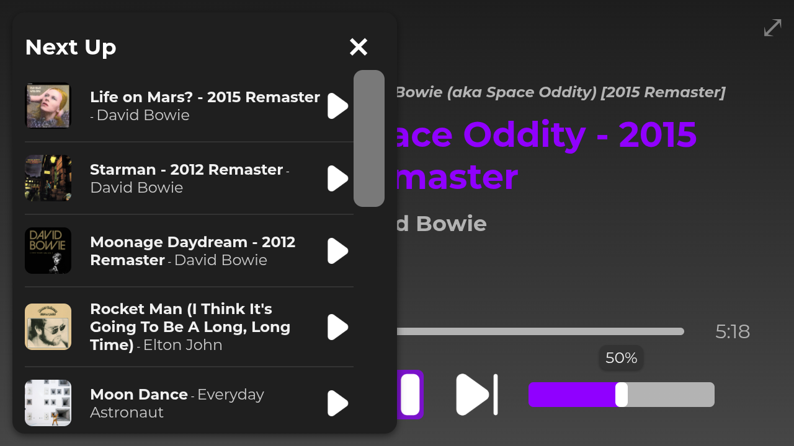
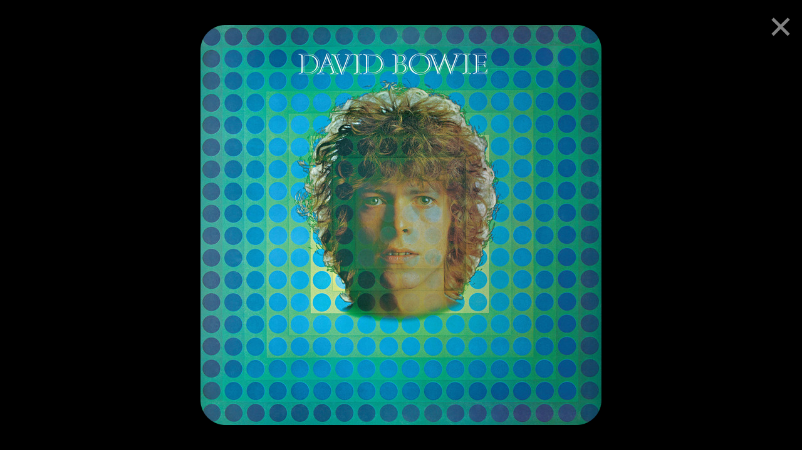
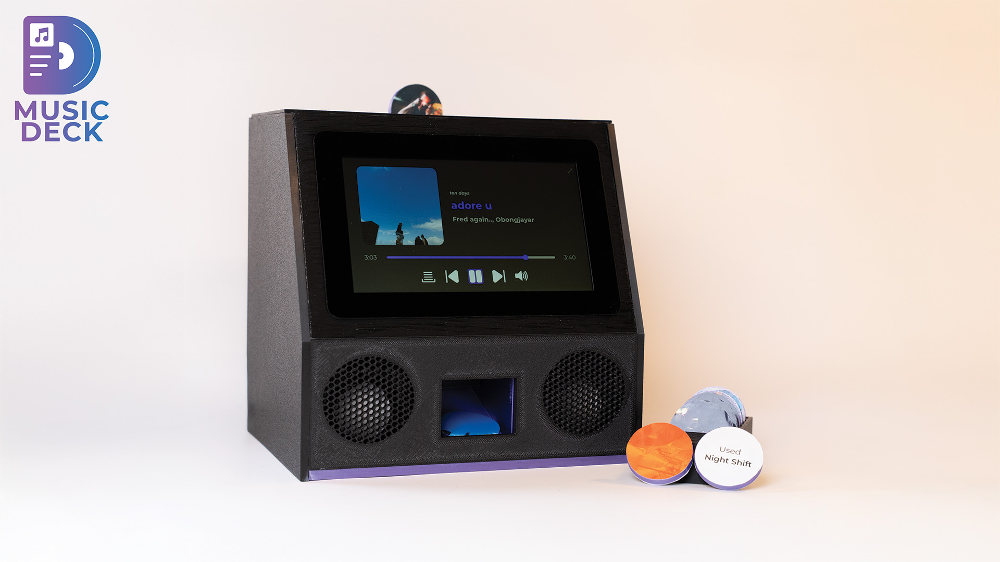

# :dvd: Final work - Music Deck
This repository is the home of all code needed to run the Music Deck project, a Spotify webplayer app that plays music using the Spotify Web API and Web Playback SDK. Playback is started by scanning an RFID-tag in in the device, which is connected to a Raspberry Pi. The app is built using Node.js and Express for the backend API, and HTML, CSS, and JavaScript for the frontend. The scripts for reading and writing to the RFID-tag are written in Python. The model for the case is designed in Tinkercad and can be 3D printed with the file included. 

## :flower_playing_cards: Screenshots
Extra functions include a queue, volume slider and fullscreen mode. The app is designed to be used on a touchscreen, but can also be used with a mouse and keyboard. <br><br>
<br>
<br>
<br>
<br>

## :wrench: Installation
### :bust_in_silhouette: Prerequisites
- [ ] Have a Spotify account with a premium subscription
- [ ] Create a Spotify app in the [Spotify Developer Dashboard](https://developer.spotify.com/dashboard/applications)
  - [ ] Save the `Client ID` and `Client Secret` for later use
  - [ ] Add a redirect URI in the Spotify app settings (e.g. `http://localhost:8888/callback`). It is important to use this URL in the rest of your code when authenticating with Spotify.
  - [ ] In "APIs used", choose `Web Playback SDK` and `Spotify Web API`
- [ ] Create a `.env` file in the root directory of the project and add the following:
    ```bash
    CLIENT_ID=<your-client-id>
    CLIENT_SECRET=<your-client-secret>
    API_URL=http://localhost:8888
    CLIENT_URL=http://localhost:5500
    ```
- [ ] Check the [`config.js`](./config.js) file and make sure the apiUrl matches the `API_URL` in the `.env` file
- [ ] The scopes for authentication are set in the [`api.js`](api.js) file. Choose `'user-read-private', 'user-read-email', 'user-read-playback-state', 'user-modify-playback-state', 'streaming'`. You can find more scopes in the [Spotify Web API documentation](https://developer.spotify.com/documentation/general/guides/scopes/)

### :gear: Manual installation
1. Clone this repository and navigate to the directory
```bash
git clone https://github.com/SandroBarillaPXL/musicdeck
cd musicdeck
```
2. Install the dependencies
```bash
npm install
```	
3. Start the backend API-server, accessible at `http://localhost:8888`
```bash
node api.js
```
4. Start the frontend with a simple HTTP server of your choice, like the "live server" extension in Visual Studio Code for local use. Make sure the frontend is accessible at `http://localhost:5500` (or the same URL you send your callbacks to. See [Prerequisites](https://github.com/SandroBarillaPXL/musicdeck?tab=readme-ov-file#gear-prerequisites)).
<br>

### :gear: Python installation
Big thanks to Angus Young from PiMyLifeUp for the clear and concise [tutorial](https://pimylifeup.com/raspberry-pi-rfid-rc522/) on how to set up the RFID reader on a Raspberry Pi. The code in this repository is based on that tutorial, but modified to work with the Music Deck app. Follow the steps listed there to set up the RFID reader on your Raspberry Pi.
<br><br>
When you're ready to write your own RFID tags, run
```bash
python3 write_rfid.py
```
and then paste the URI you want to write to the tag in the CLI.
<br>
See [`write_rfid.py`](./write_rfid.py) and [`read_rfid.py`](./read_rfid.py) for more information on how to use the scripts.

### :whale: Docker installation
1. Clone this repository and navigate to the directory
```bash
git clone https://github.com/SandroBarillaPXL/musicdeck
cd musicdeck
```
2. Build the Docker images (optional) for both the [frontend](docker/Dockerfile-fe) and [backend](docker/Dockerfile-be)
```bash
docker build -t <username>/<imagename-frontend>:<tag> -f docker/Dockerfile-fe .
docker build -t <username>/<imagename-backend>:<tag> -f docker/Dockerfile-be .
```
3. Run the Docker containers
```bash
docker run -d -p 5500:80 <username>/<imagename-frontend>:<tag>
docker run -d -p 8888:8888 <username>/<imagename-backend>:<tag>
```
<br>

Alternatively, you can use the [`docker-compose.yml`](docker/docker-compose.yml) file to run the containers. By default, the app is available at [`http://localhost:5500`](http://localhost:5500).
```bash
docker compose -f ./docker/docker-compose.yml up -d
```

## :rocket: Usage
1. Open the app in your browser at `http://localhost:5500`
2. Click the "Login with Spotify" button to authenticate with your Spotify account
3. After logging in, you will be redirected to the home page of the app
4. Scan an RFID tag with the RFID reader connected to the Raspberry Pi
5. The app will start playing the song(s) associated with the scanned tag

### :computer: Kiosk mode
Thanks to [Jeff Geerling's kiosk code](https://github.com/geerlingguy/pi-kiosk), the app can be automatically started on boot and run in kiosk mode on a Raspberry Pi. This means the app will run in fullscreen mode and the user will not be able to access the desktop or other applications. The app automatically starts with docker compose's `restart: always` option. The kiosk mode is configured in the [`kiosk.sh`](./kiosk/kiosk.sh) file, which is run on boot through the [`kiosk.service`](./kiosk/kiosk.service) service. The script starts the Chromium browser in kiosk mode and navigates to the app's URL.


## Final product
Click on the image below to see the showreel of Music Deck
[](https://www.youtube.com/watch?v=fDIq4Y5m0WE)

## :shopping_cart: Items used
<details>
<summary>Hardware</summary>

- [Raspberry Pi 4 Model B, 4GB](https://www.elektor.nl/products/raspberry-pi-4-b-4-gb-ram?variant=46907295629644)
- [Raspberry Pi Touch Display 2](https://www.elektor.nl/products/raspberry-pi-touch-display-2?variant=48853434892620)
- [microSD-kaart voorgeïnstalleerd met Raspberry Pi OS (32 GB)](https://www.elektor.nl/products/microsd-card-pre-installed-with-raspberry-pi-os-32-gb?variant=46907112063308)
- [Audiocore AC870 Compacte 2.0 stereo luidspreker voor pc, 2 x 3 W, RMS, zwart](https://www.amazon.com.be/-/nl/dp/B01LCXFEMM)
- Various PLA filament colors for 3D printing the case. Model can be found in the file [`The Music Deck.stl`](./The%20Music%20Deck.stl) in the root directory of this repository.
</details>
<details>
<summary>RFID things</summary>

- [BABIQT MIFARE Klassiek 1K S50 RFID NFC zelfklevende etiketten - Smart RFID-etiketten ISO 14443A 13,56 MHz Mifare MF1 1K - 2,5 cm ronde stickers](https://www.amazon.com.be/-/nl/dp/B0BZRS35CT)
- [AZDelivery 40 stuks Jumper F2F Female to Female kabel 20 cm compatibel met Arduino en Raspberry Pi Breadboard met e-book](https://www.amazon.com.be/-/nl/dp/B07KYHBVR7)
- [AZDelivery RC522 RFID-set met lezer, chip en 13,56 MHz SPI-kaart, compatibel met Arduino en Raspberry Pi met e-book](https://www.amazon.com.be/-/nl/dp/B01M28JAAZ)
</details>

## :information_source: Sources
<details>
<summary>Tutorials</summary>

- [Spotify Web Playback SDK Tutorial](https://www.youtube.com/watch?v=TN1uvgAyxE0)
- [How to Set Up a Raspberry Pi RFID RC522 Chip](https://pimylifeup.com/raspberry-pi-rfid-rc522/)
- [I Control EVERYTHING with this Raspberry Pi - Jeff Geerling](https://youtu.be/gpyYCTgJO88?si=_tISi13PRDC2j-k6)
</details>
<details>
<summary>Documentation</summary>

- [Spotify Web API Documentation](https://developer.spotify.com/documentation/web-api/)
- [Spotify Web Playback SDK Documentation](https://developer.spotify.com/documentation/web-playback-sdk/)
</details>
<details>
<summary>GitHub Repositories</summary>

- [nodejs-spotify GitHub Repository](https://github.com/adanzweig/nodejs-spotify)
- [spotify-web-api-node GitHub Repository](https://github.com/thelinmichael/spotify-web-api-node)
- [pi-kiosk by Jeff Geerling](https://github.com/geerlingguy/pi-kiosk)
</details>
<details>
<summary>AI Conversations</summary>

- [ChatGPT conversation 1](https://chatgpt.com/share/672b4885-9bf4-8009-b327-ca86d2885d0b)
- [ChatGPT conversation 2](https://chatgpt.com/share/6836d76b-6a24-8009-b279-d4ab5b41c2f6)
- [ChatGPT conversation 3](https://chatgpt.com/share/6800f145-c604-8009-9549-a21ab16f4d6b)
- [ChatGPT conversation 4](https://chatgpt.com/share/6836d7b7-bf84-8009-a0f0-1e9a7e1974a8)
- [ChatGPT conversation 5](https://chatgpt.com/share/6836d7cb-d378-8009-b377-d4290722423c)
- [Grok conversation 1](https://grok.com/share/c2hhcmQtMg%3D%3D_03b14119-7e32-4e7f-b8f0-faa1fa56d072)
- [Grok conversation 2](https://grok.com/share/c2hhcmQtMg%3D%3D_6b4d6956-0461-40cd-90e7-d7fd8253204c)
- [Grok conversation 3](https://grok.com/share/c2hhcmQtMg%3D%3D_84b031c0-91d0-4d90-99f5-515b1bae8478)
</details>